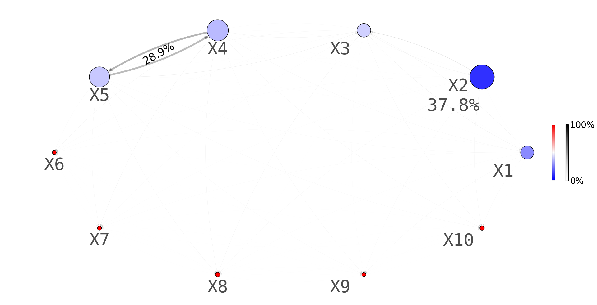

# Collaborative Trees Ensemble


Collaborative Trees Ensemble is a tree-based model designed for comprehensive feature analysis. It is capable of inferring overall feature importance, additive effects, and interaction effects. The package provides functions for generating network diagrams to visualize these effects, offering insights into complex relationships within your data.

With Collaborative Trees Ensemble, you can efficiently analyze feature interactions and uncover nuanced patterns in your datasets. Whether you're working on predictive modeling, exploratory data analysis, or feature engineering tasks, this package provides powerful tools to enhance your workflow.


## Installation

1. Install Anaconda Distribution following the instraction here: <https://docs.anaconda.com/free/anaconda/install/mac-os/>

2. Download the directory `Collaborative-Trees-Ensemble` and put it in `YOURPATH`.

3. Run the following code in your terminal to set up your conda environment. The name of your new conda environment is `myenvironment`.

```conda create -n myenvironment python=3.10.12```

4. Run the following code to activate your conda environment:

```conda activate myenvironment```

5. Install the dependencies of Collaborative Trees Ensemble under your conda environment using the following command:

```conda install xgboost==1.5.0 numpy anaconda::scikit-learn intel::hyperopt matplotlib networkx openml scipy```

6. Run the following code in your terminal:

```python3 YOURPATH/Collaborative-Trees-Ensemble/CTE/example.py```

For more information about conda environment: <https://conda.io/projects/conda/en/latest/user-guide/getting-started.html#>

Alternatively, you can use IDEs like Spyder in conda, which provide friendly tools for visual learners.

## Dependencies

The following are my environments:

* Spyder version: 5.5.1 (conda)
* Python version: 3.10.12 64-bit
  
  _Early versions of Python do not support type hints. The package `hyperopt` may not be compatible with the latest Python version. :c_
  
* Conda version: 24.3.0

* xgboost: Used for boosting algorithms (version 1.5.0).
* sklearn: Provides machine learning algorithms and utilities (version 1.2.2).
* scipy: Scientific computing library for numerical operations (version 1.11.1).
* hyperopt: Library for hyperparameter optimization (version 0.2.7).
* matplotlib: Plotting library for visualization (version 3.7.2).
* networkx: Library for graph-based algorithms (version 3.1).
* openml: Platform for sharing and exploring datasets (version 0.12.2).

## Usage

The following file demonstrate the basic usage of Collaborative Trees Ensemble.

>main_py/example.py

The following file is for the embryo dataset anaylsis in the paper.

>main_py/embryogrowth.py

The following files are for the openML dataset anaylsis in the paper.

>main_py/open_ml.py
>
>main_py/openml_score_print.py
>
>main_py/open_ml_download_datasets.py

The following files are for the simulation experiments in Section 5 of the paper.

>main_py/example_bias.py
>
>main_py/example_plot.py


## Example
```
import numpy as np

from method.cte import CollaborativeTreesEnsemble 
from method.util.plot_network import plot_network_start

n = 500
p = 10
X = np.random.uniform(0, 1, n * p).reshape(n, p)
y = 5 * X[:, 0] + 10 * X[:, 1] + 20 * (X[:, 2] - 0.5)**2 \
        + 10 * np.sin(np.pi * X[:, 3] * X[:, 4])
y = y + np.squeeze(np.random.multivariate_normal(
                        [0], [[1]], size = y.shape[0]))
print('hi')
best_param = {'n_trees': 6,
     'min_samples_split': 5,
     'min_samples_leaf': 5,
     'random_update': 1,
     'alpha': 1,
     'max_depth': 20,
     'n_bins': None}
forest = CollaborativeTreesEnsemble(n_estimators = 100,
        dict_param = best_param)

forest.fit(X, y)

# Call the function to generate the network plot:
parameters = {'base_size': 8500, 'base_edge_size': 4,
              'horizontal_positive_shift': 0.1,
              'horizontal_negative_shift': 0.0,
              'vertical_positive_shift': 0.15,
              'vertical_negative_shift': -0.1,
              'label_font_size': 40, 'edge_label_font_size': 25}
plot_network_start(forest.diagram_pack, parameters, digits = 1)
```




## License

This project is licensed under the MIT License - see the LICENSE file for details.

## Contact Information

Chien-Ming CHI

Institute of Statistical Science

Academia Sinica

xbb66kw at gmail.com


